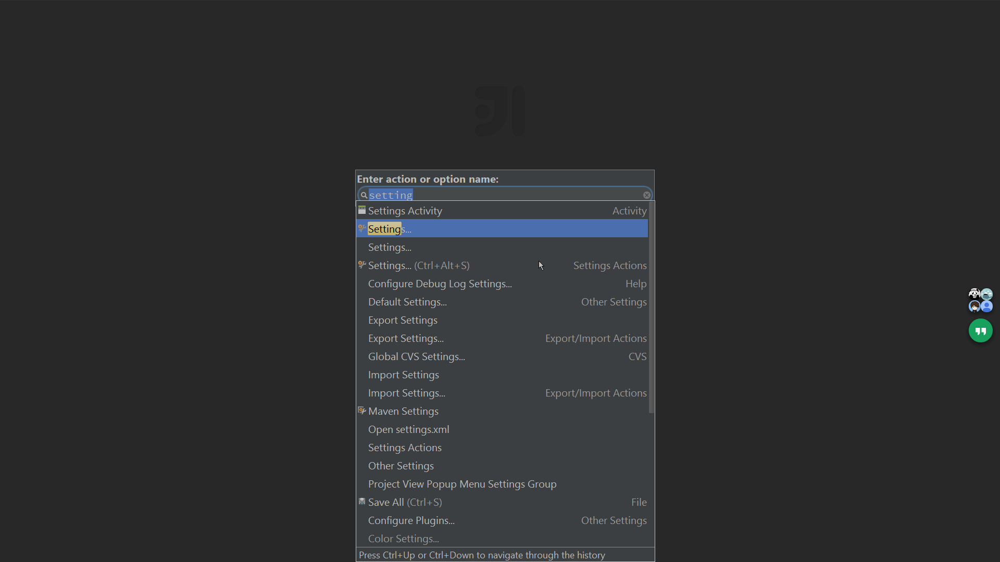
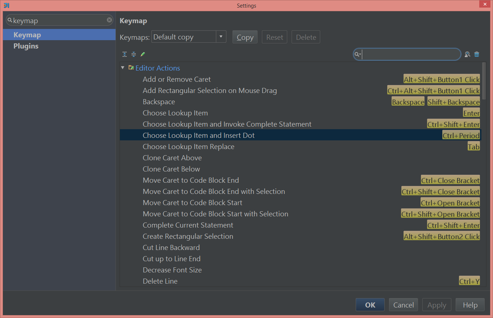

# Usage for *Intellij IDEA*

## How To Explore

- [Help](https://www.jetbrains.com/idea/help/intellij-idea.html)
- Find Action *Ctrl-Shift-A*

 

- Productivity Guide
 
 

- Default keymap reference

 
 
- Keymap

 
 
- Plugin: key promoter

 

## Seach Everywhere

- Serch Everywhere *Shift-Shift*
- Find Action *Ctrl-Shift-A*
- Find Class *Ctrl-N*
- Find File *Ctrl-Shift-A*
- Incremental Search
- Find In Path *Ctrl-Shift-F*
- Find Word At Caret *Ctrl-F3*
- Search Structural

## Switch

- Switcher *Ctrl+(Shift)+TAB*
- Recent files *Ctrl+E*
- Project *Alt+1*
- Favorites *Alt+2*  *F11* *Ctrl+F11*
- TODO *Alt+6*
- Structure *Alt+7* (一下打开，两下获取焦点)
- Hide Active Tool Window *Shift+Esc*
- Tool window mode: Pinned, Floating, as Tabs, Docked, Split

  UI preview: Pinned, Floating
  Project, TODO: Unpinned, Floating

## Edit& Navigation

- Use "CamelHumps" words
- Plugin: Browse word at caret/ AceJump
- Move caret by word *Ctrl+Up/Down/Left/Right* (shift: select)
- Move caret by method *Alt+Up/Down/Left/Right* (shift: move line)
- Copy, Cut, Duplicate line *Ctrl+C,X,D* 
- Home, End, PaDn, PaUp
- File Structure *Ctrl+F12*
- MutlipCaret (Alt+J, )
- Scratch

## Version Control

- Local History

## Code Generator

- Override methods *Ctrl+O*
- Delegate methods
- Setter
- Getter
- Constructor
- toString(), hashCode(), equals()
- 